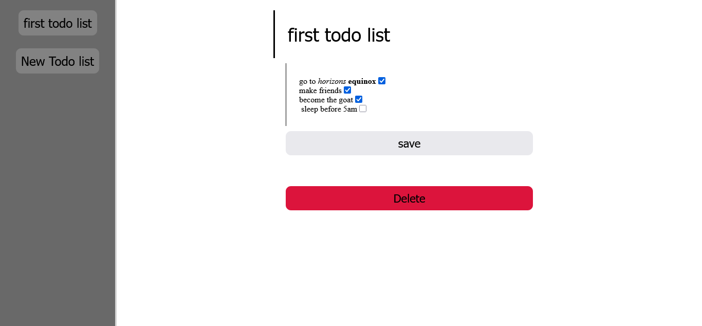

# Zotion

Ready to organize like never before

## Technology used

this website front end is made using html,css,javascript

and the back end is made using python fastapi and deployed using railway

it uses an sqlite3 database

## Features

### logging in

this website uses JWT tokens for verification

this means only you can see what you do

every request requires authorization using jwt tokens except for the login and register which give you the jwt token itself

### Parsing

the todos in this project are in a very simple format

a title which is always an h1 size

and content which is your actual todo list

the content is always parsed and converted to html

- \*something here\* to make something look italic like this -> *something*
- \*\*something\*\* to make something look bold like this -> **something**
- finally you can use [ ] with the space to make a check box that is not checked yet
or just use [/] to make it checked

so it is a parser that converts from markdown to html

### Total security

as for security it is already said that the project uses jwt tokens for authentication and authorization but this can be easily hacked

thats why i added a .env file that is not commited that contains the secret key to encrypt the jwt token

### Editing

Zotion supports adding new todos, editing existing ones, deleting the ones you dont like

## endpoints

### dashboard

this is a built in dashboard from fastapi where you can try all requests that you want

https://zotion-backend-production.up.railway.app/docs

this is the link

please use this link for everything if you are just testing if the api works

### todo/{user_id}

this is a get endpoint that takes your jwt token and your user_id and checks for a match for security then gives you your lists of todos

https://zotion-backend-production.up.railway.app/todo/{user id here}

this is the link

just replace the {user id here} with your actual user id

### add_todo

this is a post endpoint that takes the title, content, and the token

it gets the user id from the token and makes a new todo list

https://zotion-backend-production.up.railway.app/add_todo/

this is the link

### edit_todo

this is a post endpoint that takes the title, content, the id of the todo and the token

it verifies the token and matches the token with its holder and authorizes them

it takes the new title and contents to change to and the id to know which todo to change

https://zotion-backend-production.up.railway.app/edit_todo/

### delete_todo

this is also a post endpoint that only takes the token and the id of the todo

https://zotion-backend-production.up.railway.app/delete_todo/

this is the link

### login

this is also a post endpoint that takes the username and password and verifies if a user exists with these credentials

https://zotion-backend-production.up.railway.app/login/

this is the link

### register

this is another post endpoint that takes the username and password to add them and checks if a username exists with this username first then adds them

https://zotion-backend-production.up.railway.app/register/

this is the link

## How to clone

just use this simple code

`git clone https://github.com/zezo386/Zotion`

then create a file named ".env" and write in this syntax

secretkey=(put your secret key here)

and just replace it

## Author

this is made by Ziad Elhusiny The GOAT of programming
